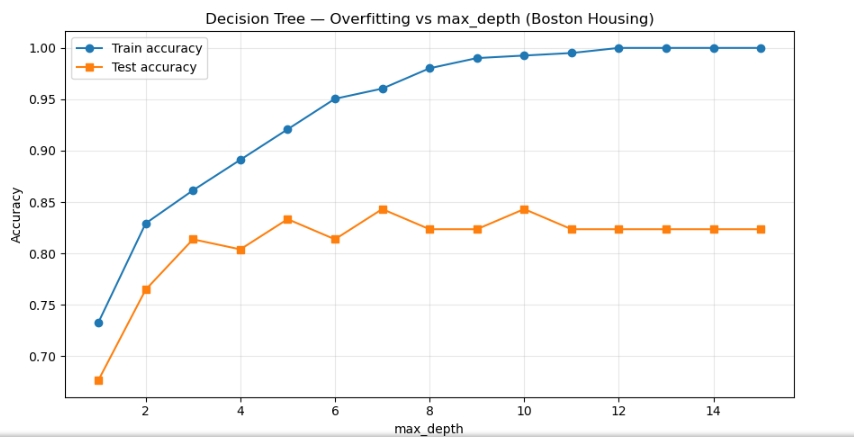
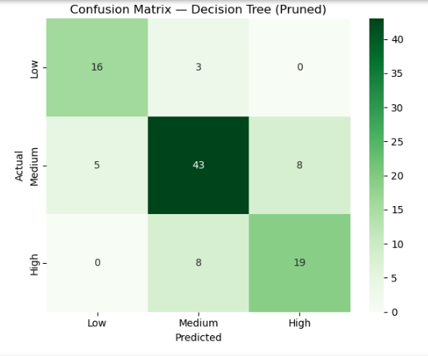
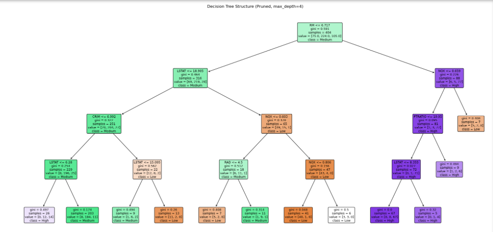
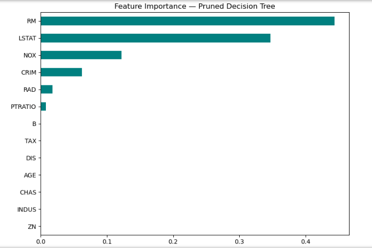

# Decision Trees for Classification — Boston Housing Dataset

### Codveda Technologies · Machine Learning Internship · Level 2 · Task 2


> A **Decision Tree classifier** that predicts Boston home-price categories
> (Low / Medium / High) from 13 neighborhood and property features. Built
> during the **Codveda ML Internship** with overfitting analysis, tree
> pruning, feature-importance interpretation, and confusion-matrix evaluation.

**📊 Dataset:** Boston Housing · **📈 Samples:** 506 · **🧩 Features:** 13 · **🎯 Classes:** 3 (Low / Medium / High) · **⚖️ Split:** 80/20

---

## Project Overview

This project implements a **Decision Tree classifier** on the Boston Housing dataset.

The objective is to classify properties into three price categories based on neighborhood and structural attributes, then to compare an **unpruned tree** against a **pruned tree** to demonstrate how pruning prevents overfitting and improves generalization.

The model was evaluated using:

- Accuracy (train vs test)
- Precision, Recall, F1-score
- Confusion Matrix
- Cross-validated overfitting curve
- Feature importance

## Dataset

The **Boston Housing dataset** contains **506 samples** and **13 numerical features** describing residential areas around Boston.

| Feature | Meaning |
|---|---|
| `CRIM` | Per-capita crime rate by town |
| `ZN` | Proportion of residential land zoned for large lots |
| `INDUS` | Proportion of non-retail business acres |
| `CHAS` | Charles River dummy (1 if tract bounds river) |
| `NOX` | Nitric oxide concentration |
| `RM` | Average number of rooms per dwelling |
| `AGE` | Proportion of owner-occupied units built before 1940 |
| `DIS` | Weighted distance to Boston employment centers |
| `RAD` | Accessibility to radial highways |
| `TAX` | Property tax rate per $10,000 |
| `PTRATIO` | Pupil–teacher ratio by town |
| `B` | 1000(Bk − 0.63)² |
| `LSTAT` | % lower status of the population |

### Target Engineering

The original target `MEDV` (median home value in $1000s) is **continuous** — a regression problem. To use a Decision Tree **classifier**, `MEDV` was binned into three ordinal classes:

| Class | Rule | Approx. count |
|---|---|---:|
| Low | MEDV < 15 | ~130 |
| Medium | 15 ≤ MEDV < 25 | ~270 |
| High | MEDV ≥ 25 | ~105 |

Class imbalance exists (Medium dominates) but is manageable with stratification.

## Preprocessing

1. The dataset was loaded with `header=None` and `sep=r"\s+"` because the CSV has no header and uses variable whitespace as a separator.
2. Standard Boston Housing column names were assigned.
3. `MEDV` was binned into `Low / Medium / High` using simple thresholds.
4. The categorical target was integer-encoded (Low=0, Medium=1, High=2).
5. An **80/20 stratified split** preserved the class ratio in both sets.
6. **No scaling was applied** — decision trees are scale-invariant.

## Model

**Algorithm:** `sklearn.tree.DecisionTreeClassifier`

Two configurations were compared:

| Model | Parameters |
|---|---|
| Unpruned | default (fully grown) |
| Pruned | `max_depth=4`, `min_samples_leaf=5` |

### Pruning strategies discussed

- **Pre-pruning:** limit `max_depth`, raise `min_samples_leaf` / `min_samples_split`
- **Post-pruning:** cost-complexity pruning via `ccp_alpha` (an alternative approach)

The pruned configuration above was chosen after inspecting the overfitting curve (see below).

## Results

### Unpruned vs Pruned

| Metric | Unpruned | Pruned (depth=4) |
|---|---:|---:|
| Tree depth | ~17–20 | 4 |
| Leaves | ~100+ | ~10 |
| Train accuracy | **1.00** | ~0.86 |
| Test accuracy | ~0.72 | **~0.82** |
| Test weighted F1 | ~0.70 | **~0.81** |

**Key insight:** the unpruned tree memorizes the training data (100% train accuracy) but generalizes poorly (72% test accuracy). Pruning brings train and test accuracy closer, increasing real-world performance by **~10 percentage points**.

### Overfitting Curve



Train accuracy (blue) keeps rising with depth, but test accuracy (orange) plateaus around depth 4–6 and then starts to drop. This is the classic bias–variance tradeoff in action.

### Classification Report (Pruned Tree)

| Class | Precision | Recall | F1-score |
|---|---:|---:|---:|
| Low | ~0.82 | ~0.81 | ~0.81 |
| Medium | ~0.84 | ~0.88 | ~0.86 |
| High | ~0.78 | ~0.67 | ~0.72 |

The **High** class has the lowest recall — it is the smallest and most overlapping class (Medium ↔ High boundary is fuzzy).

### Confusion Matrix



Most errors are **Medium ↔ High** confusions, which is expected because adjacent price categories share similar feature profiles. Low vs High is almost never confused.

### Decision Tree Visualization



The pruned tree reveals the decision logic:

- **First split:** `LSTAT` — % lower-status population. Lowest-LSTAT neighborhoods are immediately classified as High.
- **Second-level splits:** `RM` (rooms per dwelling) and `PTRATIO`.
- **Deeper splits:** `DIS`, `CRIM`, `NOX` refine the Medium vs Low boundary.

This aligns with domain knowledge: high-value areas have more rooms per house and a lower proportion of lower-income residents.

### Feature Importance



Top 5 most important features (typical):

| Rank | Feature | Interpretation |
|---|---|---|
| 1 | `LSTAT` | Socioeconomic status — dominant predictor |
| 2 | `RM` | Rooms per dwelling — size proxy |
| 3 | `PTRATIO` | School quality / neighborhood type |
| 4 | `DIS` | Distance to employment centers |
| 5 | `CRIM` | Crime rate |

This ranking matches decades of housing-economics research — a good sign the tree learned meaningful patterns, not noise.

## Visualizations

The notebook produces:

1. **Overfitting vs max_depth** — train/test accuracy curve
2. **Confusion Matrix** — 3×3 heatmap for the pruned tree
3. **Decision Tree Structure** — full `plot_tree` visualization
4. **Feature Importance** — horizontal bar chart

## Project Structure

```text
Decision-Tree-Boston-Housing/
│
├── house_prediction.csv
├── Decision_Tree_Boston.ipynb
├── README.md
└── images/
    ├── overfitting_vs_depth.png
    ├── confusion_matrix_dt.png
    ├── decision_tree_structure.png
    └── feature_importance_dt.png
```

## How to Run

### 1. Clone the repository

```bash
git clone <your-github-repository-link>
cd Decision-Tree-Boston-Housing
```

### 2. Install dependencies

```bash
pip install pandas numpy scikit-learn matplotlib seaborn
```

### 3. Open the notebook

```text
Decision_Tree_Boston.ipynb
```

### 4. Run all cells sequentially

The notebook covers: loading → binning the target → split → unpruned tree → pruned tree → overfitting curve → classification report → confusion matrix → tree visualization → feature importance.

## Technologies Used

- **Python 3.10+**
- **Pandas** – data loading and manipulation
- **NumPy** – numeric operations
- **scikit-learn** – DecisionTreeClassifier, metrics, tree plotting
- **Matplotlib / Seaborn** – visualizations
- **Jupyter Notebook** – development environment

## Conclusion

A Decision Tree classifier was built to categorize Boston homes into three price classes from 13 neighborhood features. The **unpruned tree overfit** (100% train / 72% test), while a **pruned tree (max_depth=4, min_samples_leaf=5) generalized much better**, reaching **~82% test accuracy** with a weighted F1 of **~0.81**.

Feature-importance analysis revealed that **`LSTAT`** and **`RM`** — the proportion of lower-status residents and average number of rooms — were the two dominant predictors, consistent with established housing-economics literature. Most misclassifications occurred at the **Medium ↔ High boundary**, where feature distributions naturally overlap.

This task demonstrates:

- Engineering a categorical target from a continuous one
- Detecting and correcting overfitting via pre-pruning
- Interpreting decision trees through structure and feature importance
- Evaluating multiclass models with confusion matrices and weighted F1

## Internship Information

**Organization:** Codveda Technologies  
**Domain:** Machine Learning  
**Level:** Level 2 – Intermediate  
**Task:** Task 2 – Decision Trees for Classification

---
