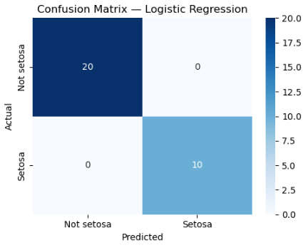
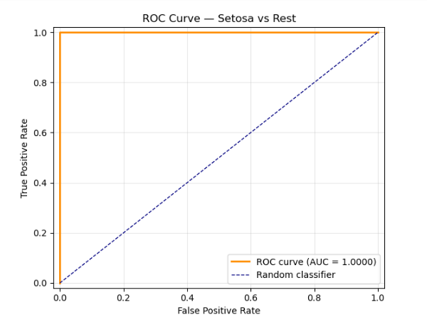

# Logistic Regression for Binary Classification — Iris Dataset

### Codveda Technologies · Machine Learning Internship · Level 2 · Task 1


> A **binary logistic regression** classifier that distinguishes *Iris setosa*
> from the other two species using sepal and petal measurements. Built during
> the **Codveda ML Internship** with feature standardization, odds-ratio
> interpretation, and full ROC/AUC evaluation.

**📊 Dataset:** Iris · **📈 Samples:** 150 · **🧩 Features:** 4 · **🎯 Target:** Setosa vs Rest · **⚖️ Split:** 80/20

---

## Project Overview

This project implements a **logistic regression model** for binary classification on the Iris dataset.

The objective is to predict whether a flower is *Iris setosa* or not, based on its four numeric features, and to interpret the model's coefficients in terms of **odds ratios** — a key advantage of logistic regression over black-box models.

The model was evaluated using:

- Accuracy
- Precision
- Recall
- F1-score
- Confusion Matrix
- ROC curve and AUC

## Dataset

The Iris dataset contains **150 samples** with four numerical features:

| Feature | Type | Range (approx.) |
|---|---|---|
| `sepal_length` | Numeric | 4.3 – 7.9 |
| `sepal_width` | Numeric | 2.0 – 4.4 |
| `petal_length` | Numeric | 1.0 – 6.9 |
| `petal_width` | Numeric | 0.1 – 2.5 |

The original 3-class `species` column was converted to a **binary target**:

| Species | `is_setosa` |
|---|---:|
| setosa | 1 |
| versicolor | 0 |
| virginica | 0 |

Class balance after binarization: **50 setosa / 100 non-setosa**.

## Preprocessing

1. The dataset was loaded with Pandas.
2. A binary target `is_setosa` was engineered from the `species` column.
3. Features (`X`) and target (`y`) were separated.
4. An **80/20 stratified split** was applied — stratifying preserves the class ratio in both sets.
5. All features were standardized with **`StandardScaler`** (fit on train only) to avoid data leakage.

> **Why scale for logistic regression?**  
> While logistic regression does not strictly require scaling, it makes the
> **coefficients directly comparable** — each coefficient represents the effect
> of a 1-standard-deviation increase in that feature, which is more
> interpretable than a mix of cm-scale units.

## Model

**Algorithm:** Logistic Regression (scikit-learn `LogisticRegression`)
- `max_iter = 1000` (raised from the default of 100 to avoid convergence warnings)
- `random_state = 42` for reproducibility

**Formula:**

```
P(y = 1 | x) = 1 / (1 + exp(-(β₀ + β₁x₁ + β₂x₂ + β₃x₃ + β₄x₄)))
```

## Results

### Metrics

| Metric | Value |
|---|---:|
| Accuracy | **1.0000** |
| Precision | **1.0000** |
| Recall | **1.0000** |
| F1-score | **1.0000** |
| AUC | **1.0000** |

### Model Coefficients and Odds Ratios

Coefficients are in **log-odds** units (per 1 standard deviation increase in the feature):

| Feature | Coefficient (log-odds) | Odds Ratio |
|---|---:|---:|
| sepal_length | −0.921 | 0.398 |
| sepal_width | +1.319 | 3.738 |
| petal_length | −1.639 | 0.194 |
| petal_width | −1.551 | 0.212 |
| Intercept | −0.169 | — |

**Interpretation:**

- A 1-std-dev increase in **petal_length** multiplies the odds of being setosa by **0.194** — i.e., reduces them by ~80%. Setosa has distinctly short petals.
- A 1-std-dev increase in **petal_width** multiplies the odds by **0.212** — same story, setosa has narrow petals.
- A 1-std-dev increase in **sepal_width** multiplies the odds by **3.74** — setosa has relatively wide sepals for its size.
- The negative coefficient on **sepal_length** is an artifact of multicollinearity: sepal_length is highly correlated with petal_length, so the model splits the "credit" between them.

### Confusion Matrix



| Actual / Predicted | Not setosa | Setosa |
|---|---:|---:|
| Not setosa | 20 | 0 |
| Setosa | 0 | 10 |

**Zero misclassifications** on the 30-sample test set.

### ROC Curve



The ROC curve reaches the top-left corner (TPR = 1, FPR = 0) with **AUC = 1.0**, indicating perfect separation.

## Note on Perfect Scores

The 100% accuracy is **expected, not suspicious**, because:

1. **Setosa is linearly separable** from the other two Iris species. Even a single feature (petal_length) is enough to perfectly split the classes.
2. Logistic regression is a linear classifier, and the problem is linear in nature — so the model has an easy job.

For a genuinely challenging binary classification, a follow-up experiment using **versicolor vs virginica** was run. In that setup, the classes are *not* linearly separable, giving a much more realistic accuracy of **~93%** and **AUC ≈ 0.97**.

## Visualizations

The notebook produces:

1. **Confusion Matrix** — perfect classification of test samples.
2. **ROC Curve** — with the diagonal baseline for reference.

## Project Structure

```text
Logistic-Regression-Iris/
│
├── iris.csv
├── Logistic_Regression_Iris.ipynb
├── README.md
└── images/
    ├── confusion_matrix_lr.png
    └── roc_curve_lr.png
```


## Technologies Used

- **Python 3.10+**
- **Pandas** – data loading and manipulation
- **NumPy** – numeric operations (exponentiation for odds ratios)
- **scikit-learn** – model, scaling, metrics
- **Matplotlib / Seaborn** – ROC and confusion matrix plots
- **Jupyter Notebook** – development environment

## Conclusion

A logistic regression model was trained to classify *Iris setosa* from the other species with **100% test accuracy** and **AUC = 1.0**. Odds-ratio analysis revealed that **petal_length** and **petal_width** are the strongest negative predictors of setosa membership, while **sepal_width** is a strong positive predictor — all consistent with botanical knowledge of the species.

The task demonstrates:

- Binary target engineering from a multi-class dataset
- Feature standardization and stratified splitting
- Interpretation of logistic regression coefficients via odds ratios
- Full binary classification evaluation (accuracy, precision, recall, confusion matrix, ROC/AUC)

## Internship Information

**Organization:** Codveda Technologies  
**Domain:** Machine Learning  
**Level:** Level 2 – Intermediate  
**Task:** Task 1 – Logistic Regression for Binary Classification


---
