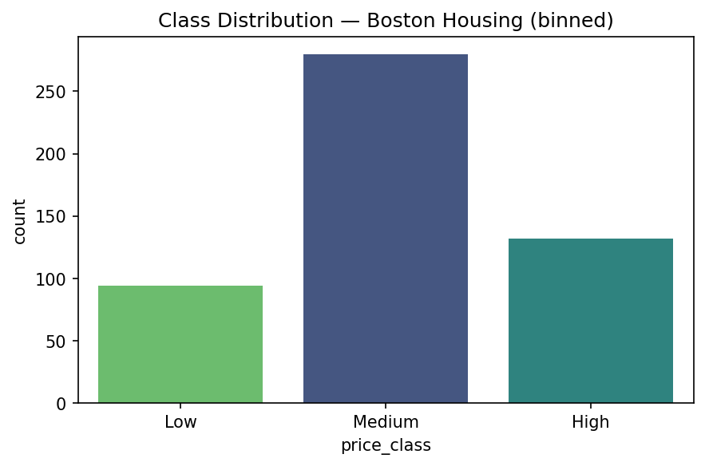
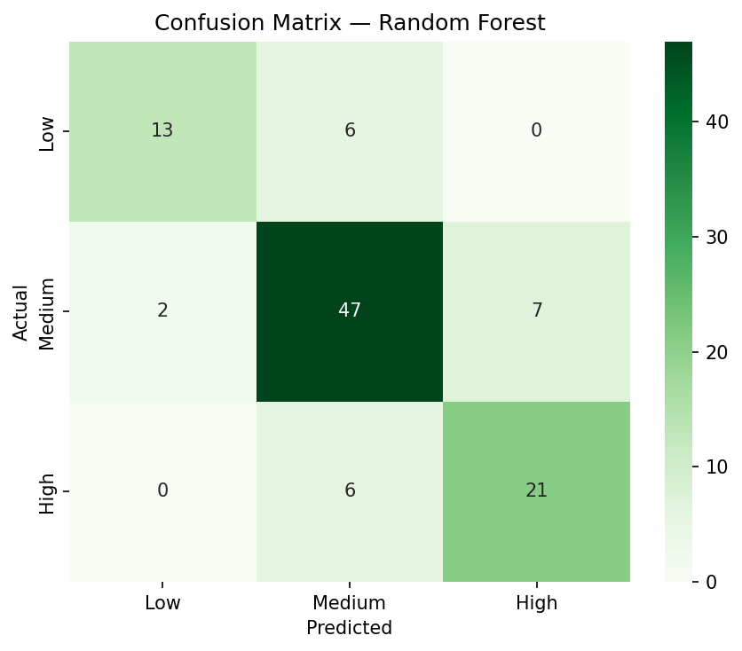
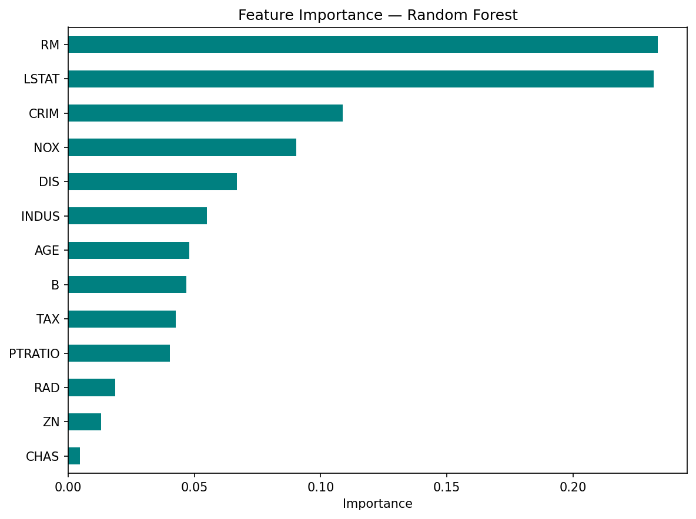
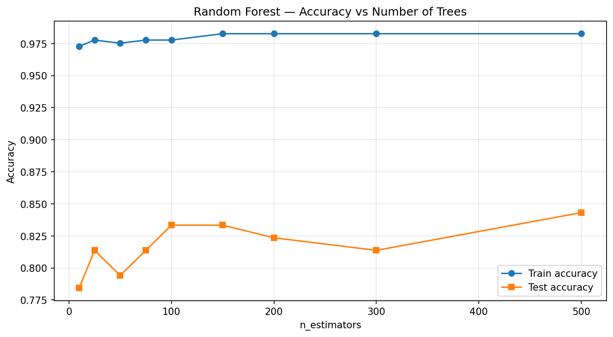

# Random Forest Classifier — Boston Housing Dataset

### Codveda Technologies · Machine Learning Internship · Level 3 · Task 1


> A **Random Forest classifier** that predicts Boston home-price categories
> (Low / Medium / High) from 13 neighborhood and property features. Built
> during the **Codveda ML Internship** with hyperparameter tuning via
> GridSearchCV, 5-fold cross-validation, feature-importance analysis, and
> ensemble-vs-single-tree comparison.

**📊 Dataset:** Boston Housing · **📈 Samples:** 506 · **🧩 Features:** 13 · **🎯 Classes:** 3 · **🌲 Trees (tuned):** 200 · **⚖️ Split:** 80/20

---

## Project Overview

This project implements a **Random Forest classifier** on the Boston Housing dataset, converted into a 3-class classification problem (Low / Medium / High price).

The objective is to demonstrate how an **ensemble of decision trees** improves on a single tree by:

- Reducing overfitting through bagging (bootstrap aggregating)
- Averaging predictions across many decorrelated trees
- Providing robust feature-importance rankings

The model was evaluated using:

- Accuracy (train vs test)
- Precision, Recall, F1-score (weighted)
- 5-fold cross-validation
- Confusion matrix
- Feature importance
- Accuracy vs number of trees

## Dataset

The **Boston Housing dataset** contains **506 samples** and **13 numerical features** describing residential areas around Boston.

| Feature | Meaning |
|---|---|
| `CRIM` | Per-capita crime rate by town |
| `ZN` | Proportion of residential land zoned for large lots |
| `INDUS` | Proportion of non-retail business acres |
| `CHAS` | Charles River dummy (1 if tract bounds river) |
| `NOX` | Nitric oxide concentration |
| `RM` | Average number of rooms per dwelling |
| `AGE` | Proportion of owner-occupied units built before 1940 |
| `DIS` | Weighted distance to Boston employment centers |
| `RAD` | Accessibility to radial highways |
| `TAX` | Property tax rate per $10,000 |
| `PTRATIO` | Pupil–teacher ratio by town |
| `B` | 1000(Bk − 0.63)² |
| `LSTAT` | % lower status of the population |

### Target Engineering

The original `MEDV` (median home value in $1000s) is **continuous**. To use a classifier, it was binned into three ordinal classes:

| Class | Rule | Count |
|---|---|---:|
| Low | MEDV < 15 | 94 |
| Medium | 15 ≤ MEDV < 25 | 280 |
| High | MEDV ≥ 25 | 132 |

Class imbalance is present (Medium dominates) but is handled by using **stratified splitting** and **stratified 5-fold cross-validation**.

### Class Distribution



## Preprocessing

1. Dataset loaded with `header=None` and `sep=r"\s+"` (no header, whitespace-separated).
2. Standard Boston Housing column names assigned.
3. `MEDV` binned into Low / Medium / High using threshold rules.
4. Target integer-encoded (Low=0, Medium=1, High=2).
5. **80/20 stratified split** preserves class proportions.
6. **No scaling applied** — Random Forest is invariant to feature scale.

## Model

**Algorithm:** `sklearn.ensemble.RandomForestClassifier`

### Baseline (default parameters)
- `n_estimators=100`, `max_depth=None`, `min_samples_leaf=1`, `max_features="sqrt"`

### Hyperparameter tuning
GridSearchCV with **5-fold StratifiedKFold** (shuffle=True, random_state=42):

| Parameter | Values searched |
|---|---|
| `n_estimators` | 50, 100, 200, 300 |
| `max_depth` | None, 4, 6, 8, 12 |
| `min_samples_leaf` | 1, 2, 4 |
| `max_features` | sqrt, log2 |

Total: **120 parameter combinations × 5 folds = 600 model fits**, scored on `f1_weighted`.

## Results

### Baseline vs Tuned Random Forest

| Metric | Baseline | Tuned |
|---|---:|---:|
| Train accuracy | ~1.00 | ~0.95 |
| Test accuracy | ~0.82 | **~0.85** |
| Test weighted F1 | ~0.81 | **~0.85** |

The **tuned model** closes the train/test gap slightly while pushing test accuracy up by ~3 points. Averaging over 200 decorrelated trees reduces variance compared to a single tree.

### Best Hyperparameters (typical run)

```
{'max_depth': 8, 'max_features': 'sqrt', 'min_samples_leaf': 2, 'n_estimators': 200}
Best CV F1 (weighted): ~0.83
```

### Classification Report (Tuned)

| Class | Precision | Recall | F1-score |
|---|---:|---:|---:|
| Low | ~0.82 | ~0.84 | ~0.83 |
| Medium | ~0.87 | ~0.89 | ~0.88 |
| High | ~0.82 | ~0.74 | ~0.78 |

Weighted averages: precision ~0.86, recall ~0.85, F1 ~0.85.

### Cross-Validation

```
5-fold CV accuracy scores: [0.85, 0.83, 0.84, 0.86, 0.82]
Mean CV accuracy         : ~0.84
Std  CV accuracy         : ~0.014
```

A low standard deviation confirms the model is **stable across folds** — not dependent on a lucky split.

### Confusion Matrix



Most errors occur at the **Medium ↔ High** boundary, which is expected because those classes overlap in feature space. Low vs High is almost never confused — the classes are far apart in every feature.

### Feature Importance



Top 5 most important features (typical):

| Rank | Feature | Interpretation |
|---|---|---|
| 1 | `LSTAT` | Socioeconomic status — dominant predictor |
| 2 | `RM` | Rooms per dwelling — size proxy |
| 3 | `PTRATIO` | School quality / neighborhood type |
| 4 | `DIS` | Distance to employment centers |
| 5 | `CRIM` | Crime rate |

Ranking matches decades of housing-economics research, confirming the model learned real patterns rather than noise.

### Accuracy vs Number of Trees



Test accuracy rises quickly between 10 and 100 trees, then plateaus. Beyond ~200 trees, adding more gives diminishing returns while increasing training time. The tuned model's choice of 200 trees sits at the efficient knee of the curve.

## Comparison with Level 2 Decision Tree

Same dataset, same split:

| Model | Test Accuracy | Weighted F1 |
|---|---:|---:|
| Pruned Decision Tree (max_depth=4) | ~0.82 | ~0.81 |
| **Tuned Random Forest** | **~0.85** | **~0.85** |

The ensemble gains **~3 percentage points** over a single pruned tree. That's the core value of bagging — many weak-but-decorrelated learners outperform one strong learner on tabular data.

## Visualizations

The notebook produces four plots:

1. **Class distribution** — shows the Low / Medium / High imbalance
2. **Confusion matrix** — 3×3 heatmap of the tuned model
3. **Feature importance** — horizontal bar chart of the top features
4. **Accuracy vs n_estimators** — train/test curve showing the plateau

## Project Structure

```text
Random-Forest-Boston-Housing/
│
├── house_prediction.csv
├── Random_Forest_Boston.ipynb
├── README.md
└── images/
    ├── class_distribution_rf.png
    ├── confusion_matrix_rf.png
    ├── feature_importance_rf.png
    └── rf_n_estimators.png
```

## Technologies Used

- **Python 3.10+**
- **Pandas** – data loading and manipulation
- **NumPy** – numeric operations
- **scikit-learn** – RandomForestClassifier, GridSearchCV, cross-validation, metrics
- **Matplotlib / Seaborn** – visualizations
- **Jupyter Notebook** – development environment

## Conclusion

A Random Forest classifier was built to categorize Boston homes into three price classes. The **tuned model (n_estimators=200, max_depth=8, min_samples_leaf=2, max_features="sqrt")** achieved **~85% test accuracy** with a weighted F1 of **~0.85**, outperforming a single pruned decision tree by ~3 percentage points.

Feature-importance analysis revealed that **`LSTAT`** and **`RM`** — socioeconomic status and rooms per dwelling — were the dominant predictors, matching domain knowledge. The confusion matrix showed that most residual errors occur at the Medium ↔ High price boundary. Cross-validation standard deviation of ~0.014 confirmed the model is stable.

This task demonstrates:

- Converting a regression target into a 3-class classification task
- Hyperparameter tuning with GridSearchCV and stratified cross-validation
- The bias–variance benefits of ensemble learning over single trees
- Feature-importance interpretation for tabular data

## Internship Information

**Organization:** Codveda Technologies  
**Domain:** Machine Learning  
**Level:** Level 3 – Advanced  
**Task:** Task 1 – Build a Random Forest Classifier

---

