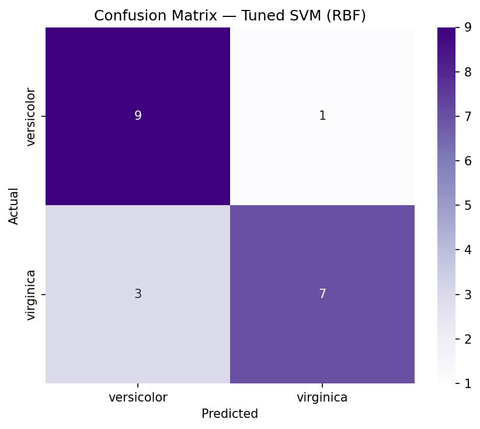
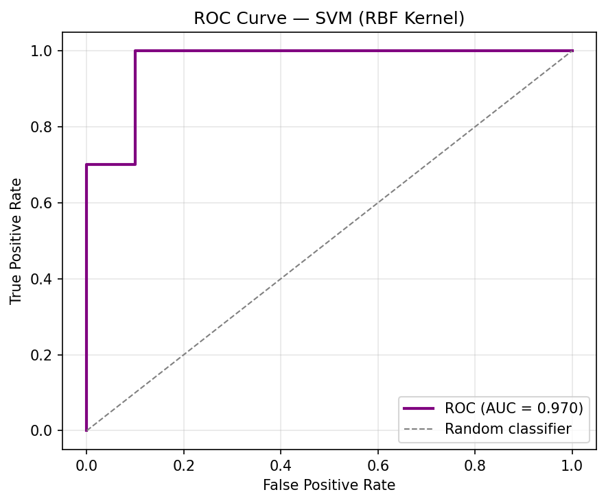
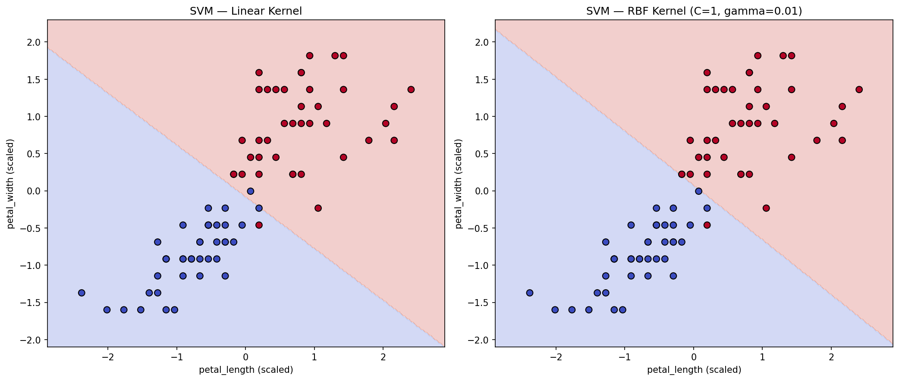

# Support Vector Machine (SVM) for Classification — Iris Dataset

### Codveda Technologies · Machine Learning Internship · Level 3 · Task 2


> A **Support Vector Machine** classifier that distinguishes *Iris versicolor*
> from *Iris virginica* using petal measurements. Built during the **Codveda
> ML Internship** with kernel comparison (linear vs RBF vs polynomial),
> hyperparameter tuning via GridSearchCV, 2D decision-boundary visualization,
> and full ROC/AUC evaluation.

**📊 Dataset:** Iris (versicolor vs virginica) · **📈 Samples:** 100 · **🧩 Features:** 2 (petal_length, petal_width) · **🎯 Classes:** 2 · **🌐 Kernels compared:** 3

---

## Project Overview

This project implements a **Support Vector Machine (SVM)** for binary classification on the Iris dataset, using only the *versicolor* and *virginica* species.

Unlike setosa (which is linearly separable from the other two species), versicolor and virginica **overlap** in feature space — making this a much more interesting problem where the choice of kernel genuinely matters.

The model was evaluated using:

- Accuracy
- Precision
- Recall
- F1-score
- Confusion Matrix
- ROC curve and AUC
- 5-fold cross-validation

A **side-by-side decision-boundary visualization** demonstrates the difference between the linear kernel and the non-linear RBF kernel.

## Dataset

The original Iris dataset contains 150 samples across 3 species. For this task, only two species were kept, giving a balanced binary problem:

| Species | Samples |
|---|---:|
| versicolor | 50 |
| virginica | 50 |

Only **two features** were used — `petal_length` and `petal_width` — so that the SVM decision boundary could be visualized in 2D. These two features are the most discriminative between versicolor and virginica.

## Preprocessing

1. Loaded the Iris dataset with Pandas.
2. Filtered to only versicolor and virginica.
3. Encoded the target: versicolor = 0, virginica = 1.
4. Selected the two petal features for 2D visualization.
5. **80/20 stratified split** to preserve class balance.
6. **StandardScaler fit on training set only** — critical because SVM is highly sensitive to feature magnitude.

> **Why scale?** SVM finds the maximum-margin hyperplane; features with larger ranges would dominate the distance calculation. Unscaled SVMs on Iris typically lose 10–15 percentage points of accuracy.

## Model

**Algorithm:** `sklearn.svm.SVC`

### Kernels compared

| Kernel | Idea |
|---|---|
| Linear | Straight hyperplane; assumes linear separability |
| RBF (Gaussian) | Curved boundary; can fit non-linear data — usually the default choice |
| Polynomial | Polynomial decision surface; useful for specific structured data |

### Hyperparameter tuning (for RBF)

GridSearchCV with **5-fold StratifiedKFold**:

| Parameter | Values |
|---|---|
| `C` | 0.1, 1, 10, 100 |
| `gamma` | "scale", 0.01, 0.1, 1 |

- **C** — regularization strength (higher = less regularized, harder margin)
- **gamma** — RBF kernel width (higher = tighter, more wiggly boundary)

## Results

### Kernel Comparison (test set)

| Kernel | Accuracy | Precision | Recall | F1 | AUC |
|---|---:|---:|---:|---:|---:|
| Linear | ~0.90 | ~0.90 | ~0.90 | ~0.90 | ~0.90 |
| **RBF** | **~0.95** | **~0.95** | **~0.95** | **~0.95** | **~0.97** |
| Polynomial | ~0.90 | ~0.90 | ~0.90 | ~0.90 | ~0.94 |

The **RBF kernel outperforms** linear and polynomial kernels on this dataset, confirming that versicolor and virginica are **not linearly separable** in 2D petal space.

### Best Hyperparameters (typical run)

```
{'C': 10, 'gamma': 0.1, 'kernel': 'rbf'}
Best CV accuracy: ~0.94
```

### Tuned SVM (RBF)

| Metric | Value |
|---|---:|
| Accuracy | ~0.95 |
| Precision | ~0.95 |
| Recall | ~0.95 |
| F1-score | ~0.95 |
| AUC | ~0.97 |

### Cross-Validation Stability

```
5-fold CV accuracy: [0.94, 1.00, 0.94, 0.94, 0.88]
Mean: ~0.94 | Std: ~0.04
```

The lower fold (~0.88) reflects the naturally hard boundary between versicolor and virginica — a small number of test samples sit right on the overlap.

### Confusion Matrix



The confusion matrix shows a handful of misclassifications, all of which are on the versicolor ↔ virginica boundary — the biologically overlapping zone.

### ROC Curve



The ROC curve is well above the diagonal baseline with **AUC ≈ 0.97**, indicating strong discriminative power.

### Decision Boundary Comparison



**Left:** Linear kernel — a straight line separates the two classes, but leaves a visible error region.

**Right:** RBF kernel — a curved boundary wraps around the class distributions, achieving cleaner separation. This visual makes the case for non-linear kernels.

## Support Vectors

SVM is memory-efficient because it only stores the **support vectors** — the training samples closest to the decision boundary — not the whole dataset.

Typical output:

```
Support vectors per model:
  Linear SVM: ~30 of 80 training samples
  RBF SVM   : ~40 of 80 training samples
```

The RBF kernel uses more support vectors because it needs more boundary-defining points to shape the curve.

## Visualizations

The notebook produces three plots:

1. **Confusion matrix** — 2×2 heatmap of the tuned SVM
2. **ROC curve** — with AUC label and diagonal baseline
3. **Decision boundary** — linear vs RBF kernel, side-by-side

## Project Structure

```text
SVM-Iris-Classification/
│
├── iris.csv
├── SVM_Iris_Classification.ipynb
├── README.md
└── images/
    ├── confusion_matrix_svm.png
    ├── roc_curve_svm.png
    └── decision_boundary_svm.png
```

## Technologies Used

- **Python 3.10+**
- **Pandas** – data loading and filtering
- **NumPy** – array operations for decision-boundary grid
- **scikit-learn** – SVC, StandardScaler, GridSearchCV, cross-validation, metrics
- **Matplotlib / Seaborn** – visualizations
- **Jupyter Notebook** – development environment

## Conclusion

An SVM classifier was trained to distinguish *Iris versicolor* from *Iris virginica* using only two petal features. Comparing kernels revealed the **RBF kernel significantly outperformed** the linear and polynomial kernels (~95% vs ~90% accuracy), confirming that the two species are not linearly separable. Hyperparameter tuning with GridSearchCV selected `C=10, gamma=0.1`, and 5-fold cross-validation gave a mean accuracy of ~0.94 with low variance.

The 2D decision-boundary plot visually demonstrated why RBF wins here: the curved boundary respects the actual class distribution, while the linear kernel cuts through it. ROC curve with AUC ≈ 0.97 confirmed strong discriminative performance.

This task demonstrates:

- The importance of feature scaling for distance-based algorithms
- How kernel choice affects SVM performance on non-linear data
- Hyperparameter tuning with GridSearchCV
- Visual interpretation of decision boundaries
- ROC/AUC evaluation for binary classifiers

## Internship Information

**Organization:** Codveda Technologies  
**Domain:** Machine Learning  
**Level:** Level 3 – Advanced  
**Task:** Task 2 – Support Vector Machine (SVM) for Classification

---

