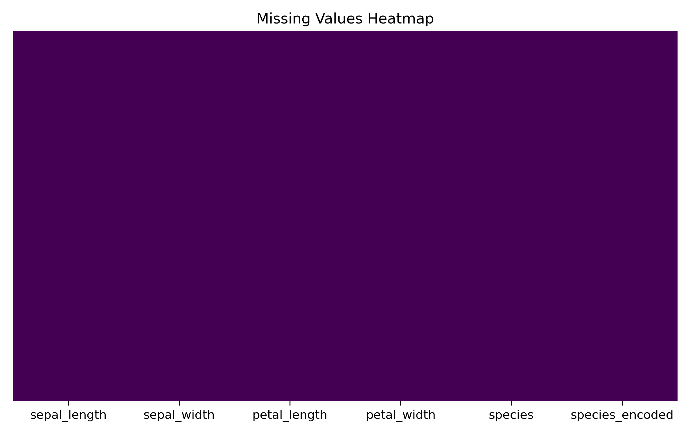
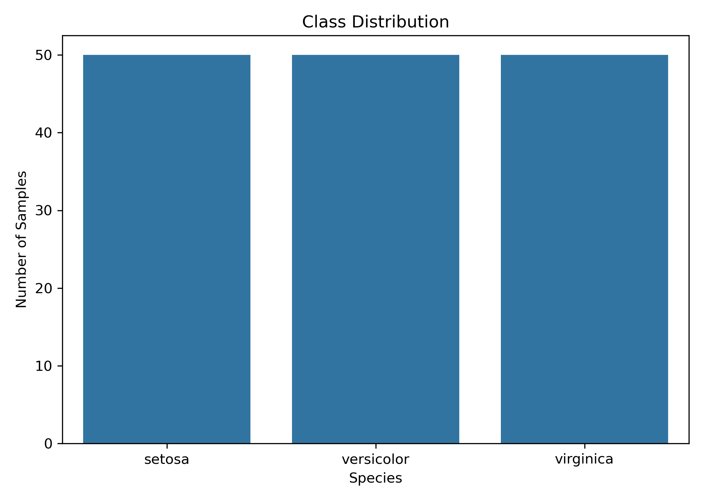
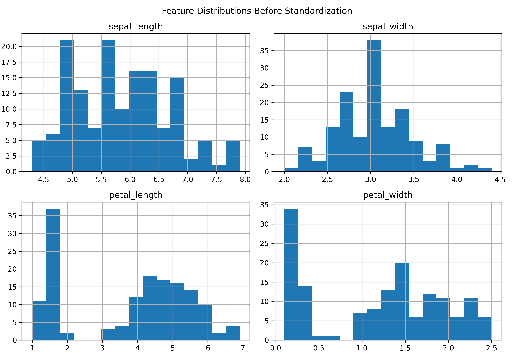
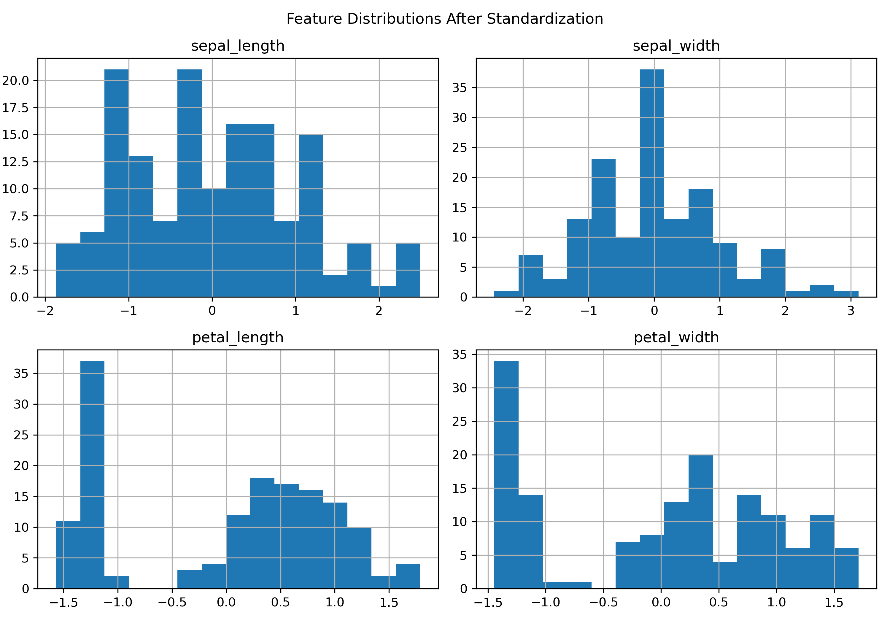

# Data Preprocessing for Machine Learning — Iris Dataset

### Codveda Technologies · Machine Learning Internship · Level 1 · Task 1


> An end-to-end **data preprocessing pipeline** that transforms a raw dataset
> into a clean, model-ready form. Built during the **Codveda ML Internship**
> with missing-value handling, categorical encoding, feature scaling, and a
> stratified train/test split.

**📊 Dataset:** Iris · **📈 Samples:** 150 · **🧩 Features:** 4 · **🎯 Classes:** 3 · **⚖️ Split:** 80/20

---

## Project Overview

This project implements a **complete data preprocessing pipeline** on the Iris dataset, preparing raw data for machine learning models.

The goal is to demonstrate the standard steps required before training any ML model:

- Handling missing data
- Encoding categorical variables
- Normalizing / standardizing numerical features
- Splitting the dataset into training and testing sets

Each step is explained and applied using **pandas** and **scikit-learn**.

## Dataset

The Iris dataset contains **150 samples** with the following features:

| Feature | Type | Range (approx.) |
|---|---|---|
| `sepal_length` | Numeric | 4.3 – 7.9 |
| `sepal_width` | Numeric | 2.0 – 4.4 |
| `petal_length` | Numeric | 1.0 – 6.9 |
| `petal_width` | Numeric | 0.1 – 2.5 |
| `species` | Categorical (target) | setosa / versicolor / virginica |

Each species has 50 samples — the dataset is perfectly balanced.

## Preprocessing Steps

### 1. Handling Missing Data

- Checked for nulls with `df.isnull().sum()`
- **Strategy applied:** rows with missing values were dropped using `df.dropna()`
- *Alternatives discussed:* mean/median imputation for numeric columns, mode for categorical columns

**Missing Values Heatmap** — visual confirmation that the dataset has no missing entries:



**Class Distribution** — each species has exactly 50 samples, confirming a balanced dataset:



### 2. Encoding Categorical Variables

The `species` column (strings) was converted to numeric using **`LabelEncoder`**:

| Species | Encoded Value |
|---|---:|
| setosa | 0 |
| versicolor | 1 |
| virginica | 2 |

**Why LabelEncoder?**  
The target has an inherent ordinal structure for scikit-learn classifiers, so a single integer per class is sufficient and memory-efficient.

**Alternative discussed:** One-Hot Encoding — better for nominal features used as *inputs* to avoid implying false ordinality.

### 3. Feature Scaling

Numerical features were standardized using **`StandardScaler`**, which transforms each feature to have:

- Mean = 0
- Standard deviation = 1

Formula:

```
z = (x - mean) / std
```

**Why scale?**  
Distance-based algorithms (KNN, SVM, K-Means) and gradient-based models (logistic regression, neural networks) are sensitive to feature magnitudes. Scaling ensures no single feature dominates.

**Feature Distributions — Before Scaling:**



**Feature Distributions — After Scaling:**



Notice how each feature is now centered around 0 with a similar spread — no single feature dominates the distance calculation.

### 4. Train / Test Split

The dataset was split using `train_test_split` with:

- **Test size:** 20% (30 samples)
- **Train size:** 80% (120 samples)
- **Stratified split:** preserves the 50/50/50 class balance in both sets
- **Random state:** 42 (for reproducibility)

## Results / Verification

After preprocessing:

| Split | Shape | Class Balance |
|---|---|---|
| Training set | (120, 4) | 40 / 40 / 40 |
| Testing set | (30, 4) | 10 / 10 / 10 |

Scaled features were verified to have mean ≈ 0 and std ≈ 1.

## Project Structure

```text
Codveda-Data-Preprocessing/
│
├── iris.csv
├── Data_Preprocessing.ipynb
├── README.md
└── images/
    ├── missing_values_heatmap.png
    ├── class_distribution.png
    ├── feature_distributions_before.png
    └── feature_distributions_after.png
```

## How to Run

### 1. Clone the repository

```bash
git clone <your-github-repository-link>
cd Codveda-Data-Preprocessing
```

### 2. Install dependencies

```bash
pip install pandas numpy scikit-learn matplotlib seaborn
```

### 3. Open the notebook

Open `Data_Preprocessing.ipynb` in Jupyter or VS Code.

### 4. Run the notebook

Run the cells sequentially to reproduce each preprocessing step, the train/test split, and the verification outputs.

## Technologies Used

- **Python 3.10+**
- **Pandas** – data loading and manipulation
- **NumPy** – numeric operations
- **scikit-learn** – encoding, scaling, splitting
- **Matplotlib / Seaborn** – visualizations
- **Jupyter Notebook** – development environment

## Conclusion

A complete data preprocessing pipeline was implemented on the Iris dataset. The raw data was:

1. Checked and cleaned of missing values
2. Encoded to convert categorical labels to numeric form
3. Standardized so all features contribute equally
4. Stratified into 80/20 train/test sets

The resulting dataset is ready for any supervised machine learning algorithm. This task demonstrates the practical importance of preprocessing — a step that often has more impact on model performance than the choice of algorithm itself.

## Internship Information

**Organization:** Codveda Technologies  
**Domain:** Machine Learning  
**Level:** Level 1 – Basic  
**Task:** Task 1 – Data Preprocessing for Machine Learning

---
