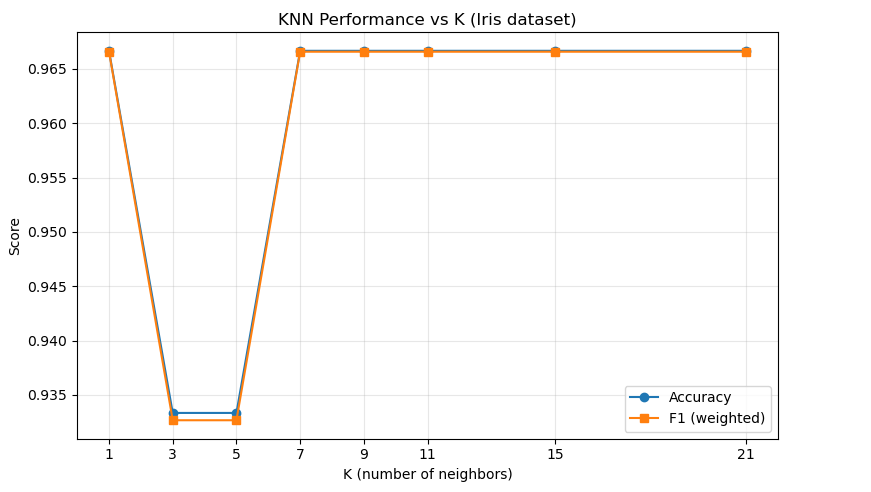
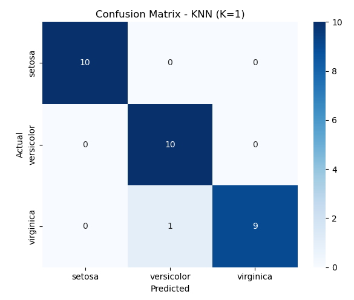

# K-Nearest Neighbors (KNN) Classifier — Iris Dataset

### Codveda Technologies · Machine Learning Internship · Level 1 · Task 3


> A K-Nearest Neighbors classifier that identifies Iris flower species
> (*setosa*, *versicolor*, *virginica*) from sepal and petal measurements.
> Built during the **Codveda ML Internship** with feature standardization,
> K-value tuning, and full classification evaluation.

**🏆 Best accuracy:** 96.67% · **📊 Samples:** 150 · **🎯 Classes:** 3 · **🔍 K range tested:** 1–21

---

## Project Overview

This project implements a **K-Nearest Neighbors (KNN) classifier** using the Iris dataset.

The objective is to classify Iris flowers into three species based on their sepal and petal measurements. Different values of **K** were tested and compared to evaluate the performance of the classifier.

The model was evaluated using:

- Accuracy
- Precision
- Recall
- F1-score
- Confusion Matrix

## Dataset

The Iris dataset contains **150 samples** and four numerical features:

- `sepal_length`
- `sepal_width`
- `petal_length`
- `petal_width`

The target variable is `species`, which contains three classes:

- `setosa`
- `versicolor`
- `virginica`

Each species contains 50 samples.

## Preprocessing

The following preprocessing steps were performed:

1. The dataset was loaded using Pandas.
2. The categorical target variable `species` was encoded using `LabelEncoder`.
3. The features and target variable were separated.
4. The dataset was divided into **80% training data and 20% testing data** using a stratified split.
5. The numerical features were standardized using `StandardScaler` because KNN is a distance-based algorithm.

### Class Encoding

| Species | Encoded Value |
|---|---:|
| Setosa | 0 |
| Versicolor | 1 |
| Virginica | 2 |

## KNN Implementation

Different K values were tested:

`1, 3, 5, 7, 9, 11, 15, 21`

The purpose was to compare how changing the number of nearest neighbors affects classification performance.

## Results

| K | Accuracy | Precision | Recall | F1-score |
|---:|---:|---:|---:|---:|
| 1 | 96.67% | 96.97% | 96.67% | 96.66% |
| 3 | 93.33% | 94.44% | 93.33% | 93.27% |
| 5 | 93.33% | 94.44% | 93.33% | 93.27% |
| 7 | 96.67% | 96.97% | 96.67% | 96.66% |
| 9 | 96.67% | 96.97% | 96.67% | 96.66% |
| 11 | 96.67% | 96.97% | 96.67% | 96.66% |
| 15 | 96.67% | 96.97% | 96.67% | 96.66% |
| 21 | 96.67% | 96.97% | 96.67% | 96.66% |

The highest test accuracy was **96.67%**, achieved by K values **1, 7, 9, 11, 15, and 21**.

The implemented procedure selected **K = 1** because it was the first K value to achieve the maximum test accuracy.

### KNN Performance vs K

The chart below shows accuracy and weighted F1-score across the tested K values. Note how accuracy is stable at K=1 and then plateaus from K=7 onward — a good sign the model is robust and not dependent on a specific K choice.



## Classification Report

For K = 1:

| Class | Precision | Recall | F1-score |
|---|---:|---:|---:|
| Setosa | 1.00 | 1.00 | 1.00 |
| Versicolor | 0.91 | 1.00 | 0.95 |
| Virginica | 1.00 | 0.90 | 0.95 |

**Overall accuracy:** 96.67%  
**Weighted precision:** 96.97%  
**Weighted recall:** 96.67%  
**Weighted F1-score:** 96.66%

## Confusion Matrix

The confusion matrix for K = 1 was:

| Actual / Predicted | Setosa | Versicolor | Virginica |
|---|---:|---:|---:|
| Setosa | 10 | 0 | 0 |
| Versicolor | 0 | 10 | 0 |
| Virginica | 0 | 1 | 9 |

The model correctly classified **29 out of 30 test samples**. One Virginica sample was classified as Versicolor.

### Confusion Matrix Heatmap



The heatmap makes the single misclassification immediately visible: one *virginica* sample was predicted as *versicolor*, which is expected because those two species overlap in petal measurements at the boundary.

## Visualizations

The project includes two key visualizations:

1. **KNN Performance vs K** — compares accuracy and weighted F1-score for different K values.
2. **Confusion Matrix** — shows the correct and incorrect predictions for each Iris species.

## Technologies Used

- Python
- Pandas
- NumPy
- Scikit-learn
- Matplotlib
- Seaborn
- Jupyter Notebook

## Project Structure

```text
KNN-Iris-Classification/
│
├── iris.csv
├── KNN_Iris_Classification.ipynb
├── README.md
└── images/
    ├── knn_performance_vs_k.png
    └── confusion_matrix.png
```

## How to Run

### 1. Clone the repository

```bash
git clone <your-github-repository-link>
cd KNN-Iris-Classification
```

### 2. Install the required libraries

```bash
pip install pandas numpy scikit-learn matplotlib seaborn
```

### 3. Open the notebook

Open:

```text
KNN_Iris_Classification.ipynb
```

### 4. Run the notebook

Run the cells sequentially to reproduce the preprocessing, KNN training, performance comparison, evaluation metrics, and visualizations.

## Conclusion

The KNN classifier was successfully implemented on the Iris dataset. Multiple K values were tested and compared using classification metrics.

The highest test accuracy obtained was **96.67%**. The confusion matrix showed that **29 out of 30 test samples were correctly classified**, with one Virginica sample misclassified as Versicolor.

This task demonstrates the practical use of KNN classification, feature standardization, model evaluation, and visualization using Python and Scikit-learn.

## Internship Information

**Organization:** Codveda Technologies  
**Domain:** Machine Learning  
**Level:** Level 1 – Basic  
**Task:** Task 3 – Implement K-Nearest Neighbors (KNN) Classifier

---
